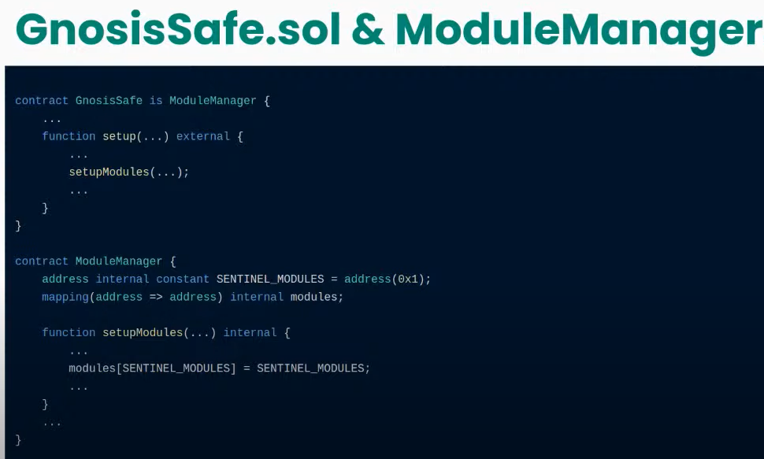
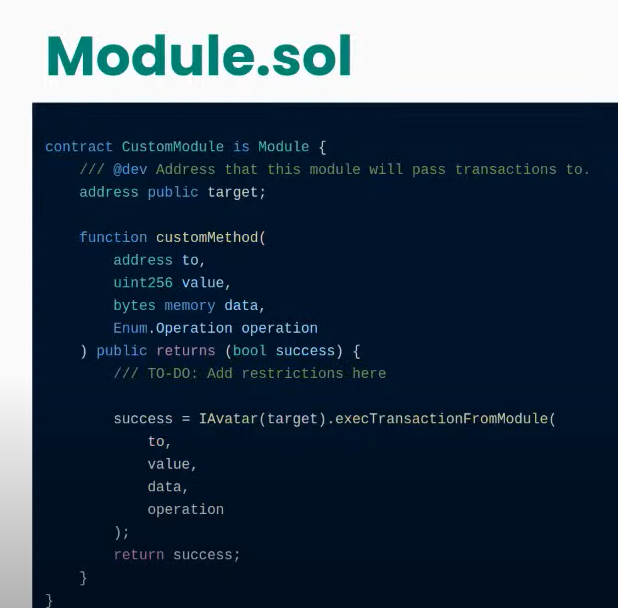
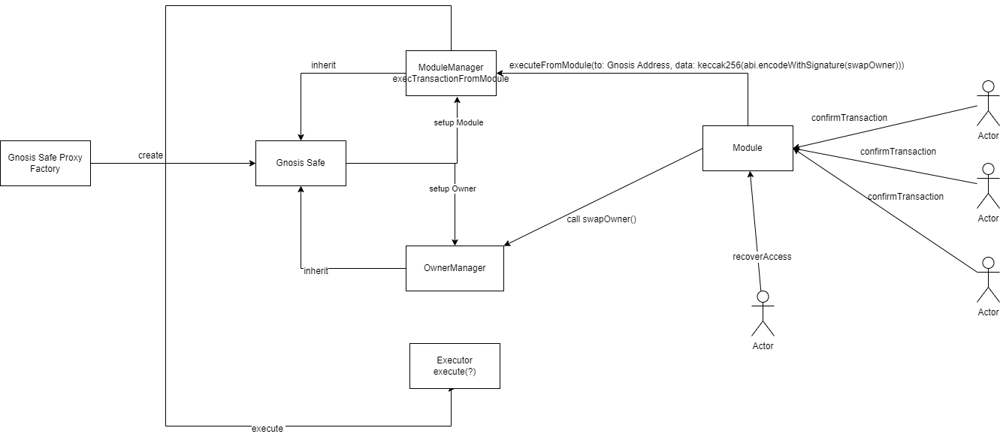
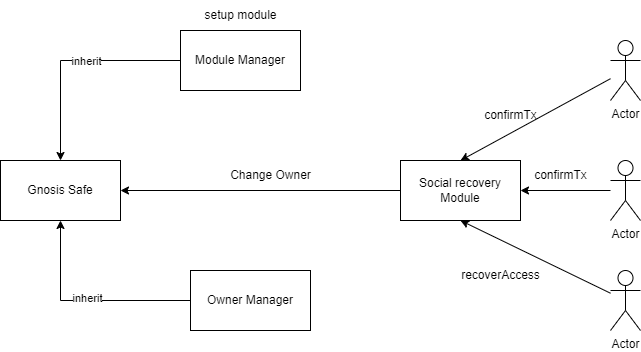

# Social recovery module

This contract allows to recover your lost wallet by a "voting" given number of "friends".
You assign several friends and a threshold number. If this number or more of friends
trigger recovery, an owner of your wallet can be replaced by a new owner as the friends specify.

It is useful for the case if you lose (or mistakenly disclose) a private key that controls your wallet.

Be careful, if your friends may be thiefs, they can instead steal it.

A similar functionality is available in Argent wallet. We need this to successfully compete.

## Setting up social recovery

The contract is designed as a single point registry. This way not every Safe needs to deploy their own module and it is possible that this module is shared between different Safes.

To set a wallet for social recovery call `setup()` method on this module with a list of "friend" addresses and the threshold.

It also can be later reconfigured by a similar `reconfigure()` method.

Social recovery can be turned off by `turnOffSocialRecovery()` method.

## Social recovery

Friends accomplish social recovery like this (if we use JavaScript code, a special not yet written dApp is more likely to be used in the future):

```javascript
const socialRecoveryModule = // ...
/// prevOwner Owner that pointed to the owner to be replaced in the linked list.
/// oldOwner Owner address to be replaced.
/// newOwner New owner address.
const data = await gnosisSafe.contract.methods.swapOwner(prevOwner, oldOwner, newOwner).encodeABI()
// Confirm transaction by N friends:
const dataHash = await socialRecoveryModule.getDataHash(data)
await socialRecoveryModule.confirmTransaction(dataHash, {from: friend[0]})
// ...
await socialRecoveryModule.confirmTransaction(dataHash, {from: friend[N-2]})
await socialRecoveryModule.recoverAccess(prevOwner, oldOwner, newOwner, {from: friend[N-1]})
```

### Contract

import [https://github.com/gnosis/zodiac/blob/master/contracts/core/Module.sol](https://github.com/gnosis/zodiac/blob/master/contracts/core/Module.sol)

import [https://github.com/safe-global/safe-contracts/blob/main/contracts/base/ModuleManager.sol](https://github.dev/safe-global/safe-contracts/blob/main/contracts/base/ModuleManager.sol)

import [https://github.com/safe-global/safe-contracts/blob/main/contracts/base/ModuleManager.sol](https://github.dev/safe-global/safe-contracts/blob/main/contracts/base/ModuleManager.sol)

In [Zodiac](https://github.com/gnosis/zodiac), [IAvatar.sol](https://github.com/gnosis/zodiac/blob/master/contracts/interfaces/IAvatar.sol) is the same as [ModuleManager.sol](https://github.com/safe-global/safe-contracts/blob/main/contracts/base/ModuleManager.sol).

### How to use create module?

https://www.youtube.com/watch?v=QdOfuxxXVBA  
**Key component**  



## Install

```bash
yarn add
```

## Compiling contracts

```bash
yarn
yarn compile
```

## Running tests

TODO: Add tests.

```bash
yarn
yarn test
```

## Architecture

### The original architecture



### Simplified architecture


